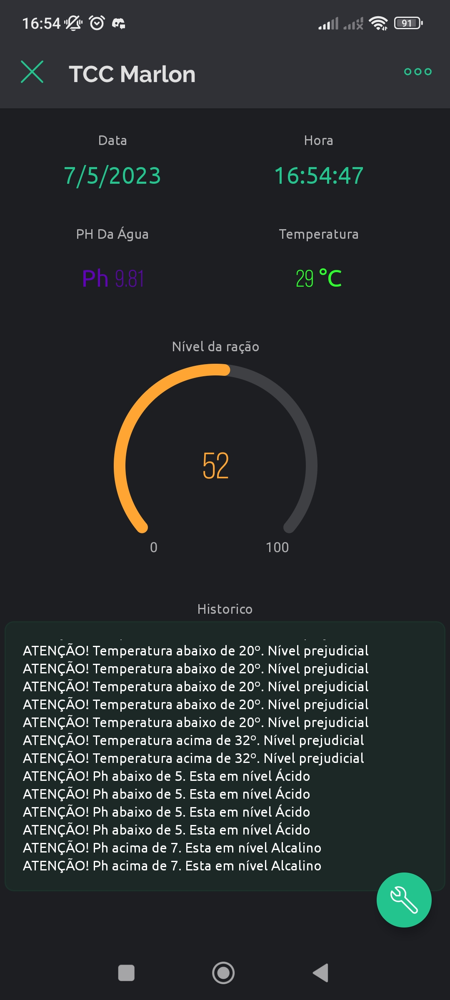
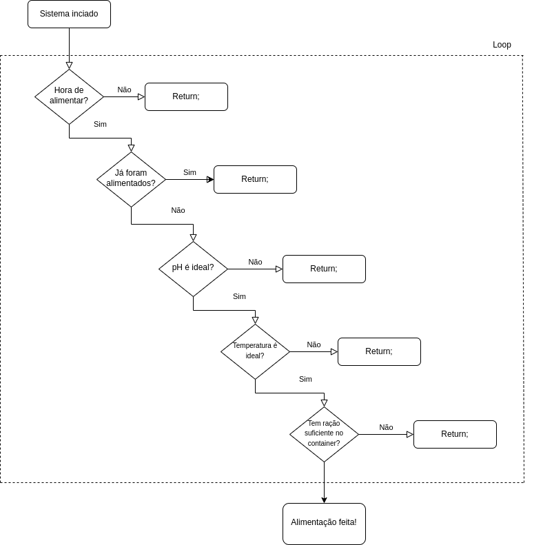

# metodologia de funcionamento

A ideia é montar um alimentador de peixes que dado um determinado valor de pH da água, horario ideal e temperatura, o sistema irá conferir se há ração suficiente e se todas as condições forem verdadeiras a alimentação será feita.

Para monitoramento e conferencia dos valores e funções será utilizado o aplicativo Blynk na versão free.

### Materiais utilizados

| Sensor/Modulo | Modelo | Imagem |
| --- | --- | --- |
| Sensor de Temperatura | DS18B20 |  |
| Sensor Ultrasom | HC-SR04 |  |
| Sensor pH | PH-4502C |  |
| Placa Arduino | MEGA 2560 |  |
| Módulo Relay | 4-Channel 5V |  |
| Enthernet Shield | HR911105A |  |
| Fonte de alimentação Arduino | 9v |  |
| Motor DC 12V | MMAMUTE  |  |
| Fonte de alimentação Motor DC | HT121810A |  |

## Bibliotecas utilizadas

| Nome | Link |
| --- | --- |
| ``<SPI.h>`` | https://github.com/arduino/ArduinoCore-avr/tree/master/libraries/SPI |  
| ``<Ethernet.h>`` | https://github.com/arduino-libraries/Ethernet |
| ```<BlynkSimpleEthernet.h>``` | https://github.com/blynkkk/blynk-library/blob/master/src/BlynkSimpleEthernet.h |
| ``<TimeLib.h>`` | https://github.com/PaulStoffregen/Time/blob/master/TimeLib.h |  
| ``<HCSR04.h>`` | https://github.com/gamegine/HCSR04-ultrasonic-sensor-lib |
| ```<OneWire.h>``` | https://www.arduinolibraries.info/libraries/one-wire |
| ```<DallasTemperature.h>``` | https://www.arduinolibraries.info/libraries/dallas-temperature |


## Container e sensor ultrasom
O container consiste em um galão de 20 litros que tem aproximadamente 35 cm de profundidade dada a posição do sensor. No funcionamento normal o sensor de ultrasom devolve a distancia do objeto a sua frente. Através do uso da regra de 3 e formulas matemáticas foi possível criar um gráfico que representa o nível de ração do container no aplicativo.
Além disso, foram criadas regras que mudam a cor do gráfico proporcionamente ao nível de ração do container.


| Porcentagem | Cor |
| --- | --- |
| Maior que 75% | <span style="color:green">Verde<span> |  
| Entre 75% e 20% | <span style="color:orange">Laranja<span> |
| Menor que 20% | <span style="color:red">Vermelho<span> |

>O sensor realiza uma nova medida a cada 10 segundos.

Uma peculiaridade sobre o sensor de ultrasom foi que ao jogar ele no loop não funcionava corretamente porque as outras funções impediam a leitura constante dele. Para resolver este problema foi necessário a utilização de uma biblioteca chamada ``<HCSR04.h>`` Essa biblioteca dispobibiliza uma função que gera a distancia em centimentros não sendo necessário calcular na mão.

Primeiro é necessário inicializar o sensor

```c
UltraSonicDistanceSensor distanceSensor(trigPin, echoPin);
```
Após isso basta chamar a seguinte função

```c
distanceCm = distanceSensor.measureDistanceCm();
```

>Outro detalhe importante sobre esse sensor é que a função deve ser chamada apenas uma vez, se for usada duas vezes seguidas os valores podem variar ou vir errados.

## Sensor de pH PH-4502C
O sensor de pH é utilizado normalmente em aquario, produção de cerveja e outras bebidas do tipo. No projeto ele será utilizado para medir o pH da água e verificar se está no ponto ideal para a alimentação dos peixes. Como a saída é analógica, a resolução fica por conta do conversor AD, sendo que em 0V teremos 0PH e com 5V teremos PH14. Em um Arduino temos 10 bits, que dá uma resolução de 1024 valores possíveis. A imagem abaixo mostra um breve exemplo de alguns produtos conhecidos e seus Ph's

<center>

</center>
<br><br>
No projeto consideramos como um Ph ideal para alimentação um valor de 6 a 8.

>O sensor faz leitura do pH a cada 10 segundos.

## Sensor de temperatura DS18B20
O sensor de temperatura DS18B20 utilizado neste trabalho além de funcionar bem é a prova d'água. Ele será responsável por medir a temperatura da água apenas. No aplicativo além de exibir os valores da temperatura, o valor também pode mudar de cor conforme o nível de temperatura da seguinte forma:


| Temperatura | Cor |
| --- | --- |
| Entre 25º e 28º | <span style="color:green">Verde<span> |  
| Menor que 25º | <span style="color:#2ECCFA">Azul<span> |
| Maior que 28º | <span style="color:red">Vermelho<span> |


>O sensor realiza uma nova medida a cada 10 segundos.

## Data e hora
Quando um novo projeto é criado no aplicativo blynk o mesmo pede para que seja definida a localização para ajuste de data e hora (_timezone_). Quando o aplicativo inicia a conexão a primeira coisa que ele faz é a sincronização de data e hora, portanto o relógio está sempre correto. Isso dispensa o uso do módulo RTC.

>Data e hora são atualizados a cada 10 segundos.

## Relay e motor alimentador

O relay pode ser considerado a parte mais simples do projeto, pois a função dele é apenas ativar ou desativar o aliemntador. O que vai definir a quantidade de ração é o tempo em que o motor ficará em atividade

> o relay só será ativado se a função de alimentar for chamada. Para isso, todos os parâmetros devem estar adequados.

## Terminal Blynk
Além de todo o controle e visualização feita através do aplicativo Blynk, pode-se também utilizar de um recurso chamado terminal que além de informar status de sensores, permite entrada de comandos que ampliam muito as possibilidades de controle no trabalho. Para este trabalho existem 2 comandos possíveis no aplicativo

`info`

O comando `info` trás informações sobre qual é a programação do arduino para alimentação, ele nos informa a hora, temperatura, nível de ração no container, e ph que devem estar setados para que a alimentação seja feita com sucesso.

`feed`

O comando `feed` serve para coletar informações sobre a alimentação. Se os peixes já foram alimentados o comando feed trará informações de pH da água, temperatura da água, nível de ração no container antes e depois da alimentação, e horário em que foi feita a alimentação. Essas informações também são úteis para realizar o acompanhamento.

#### Avisos
Uma vantagem do terminal é que ele também exibe avisos quando algo está muito desproporcional, então para temperatura, pH principalmente quando o nível está muito fora do esperado ele envia mensagens no terminal avisando sobre a irregularidade.

## O aplicativo
O Aplicativo Blynk tem uma aparência bem simples de modo que fique fácil realizar o acompanhamento do processo de alimentação e dos valores dos sensores. Abaixo, um print da tela do aplciativo

<center>
<br><br>
Tela do aplicativo Blynk - Fonte: Autoral
</center>

<br>

>Nota-se que no print o nível de pH está bem acima e por isso uma mensagem de pH acima de 7 está sendo disparada


## Funcionamento do alimentador
O Arduino é ligado com um cabo de rede conectado ao _ethernet shield_ e após isso pela tela do App é possível acompanhar que uma mensagem "Sistema inicializado" quando estiver tudo pronto. A partir disso a cada 10 segundos será feita uma verificação completa de todos os sensores para verificar se estão em conformidade ou não. A cor natural para os sensores no aplicativo é verde. Quando chegar a hora de fazer a alimentação o sistema ira verificar se os peixes já foram alimentados ou não. Isso pode variar pois por padrão eles só devem ser alimentados uma vez, mas mudando o valor da variável esse número aumenta.

Após confirmar que é a hora correta de alimentação o controlador verifica se os peixes foram alimentados, se não foram, ele verifica o pH da água, se estiver normalizado passa a verificar a temperatura, e por fim, o nível de ração do container. Se todos os parâmetros estiverem condizentes a alimentação é feita na quantia programada.

<center>
<br><br>
Diagrama de funcionamento básico - Fonte Autoral

</center>
